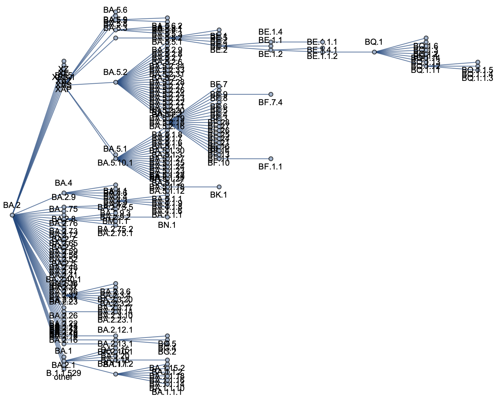
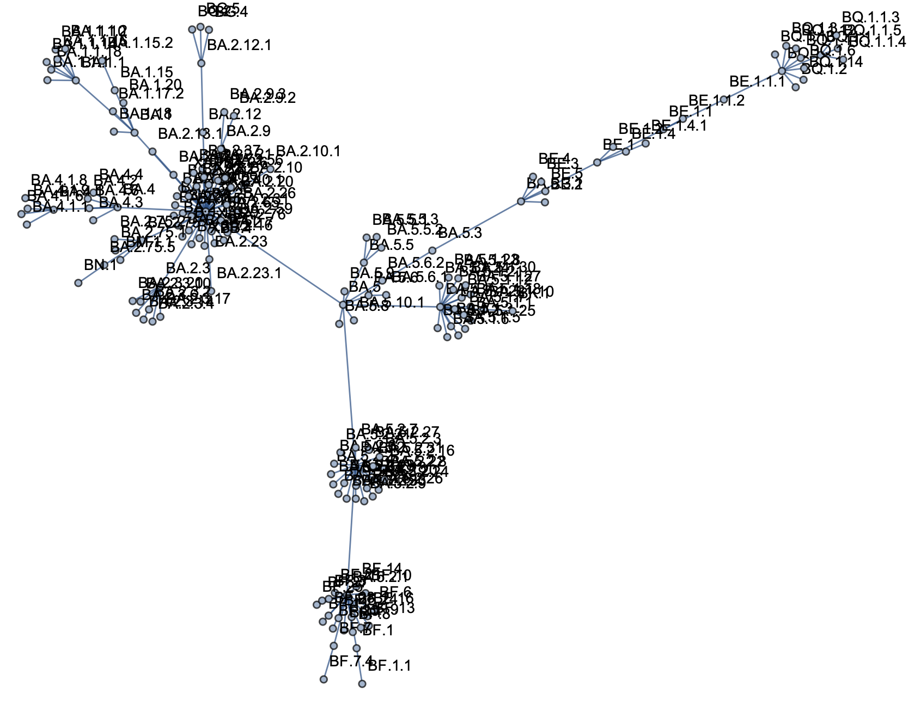

## Pango lineages dataset

This dataset only includes Pango lineages with >150 sequences in US dataset. Rarer Pango lineages are collapsed into parental lineages, ie BM.1 was collapsed into BA.2.75.3.

### Metadata

1. Nextstrain-curated metadata TSV of GISAID database was downloaded. Uncompressing and renaming this file resulted in `gisaid_metadata.tsv` via:
```
nextstrain remote download s3://nextstrain-ncov-private/metadata.tsv.gz
gzip -d metadata.tsv.gz -c > gisaid_metadata.tsv
```

2. The metadata file was pruned to only relevant columns via:
```
tsv-select -H -f strain,date,country,division,QC_overall_status,Nextclade_pango gisaid_metadata.tsv > gisaid_metadata_pruned.tsv
```

### Pango aliasing

3. Download JSON from the 21L Nextclade build:
```
curl -fsSL https://data.nextstrain.org/nextclade_sars-cov-2_21L.json -o nextclade_sars-cov-2_21L.json.gz
```

4. Decompress this file:
```
gzip -d nextclade_sars-cov-2_21L.json.gz -c > nextclade_sars-cov-2_21L.json
```

5. Extract relevant tip attributes to TSV:
```
python extract_tip_attributes.py --json nextclade_sars-cov-2_21L.json > pango_aliasing.tsv
```

This TSV looks like
```
seqName	clade	Nextclade_pango	partiallyAliased
BQ.1	22E (Omicron)	BQ.1	BA.5.3.1.1.1.1.1
BQ.1.1	22E (Omicron)	BQ.1.1	BA.5.3.1.1.1.1.1.1
```

### Counts

6. These files are processed in Mathematica by running the notebook `pango-data-prep.nb`. This results in the file `pango_location-variant-sequence-counts.tsv` versioned here. These files represent heavily derived GISAID data and are equivalent to downloadable results from [outbreak.info](https://outbreak.info), [cov-spectrum.org](https://cov-spectrum.org) and [covariants.org](https://covariants.org). This use is allowable under the [GISAID Terms of Use](https://www.gisaid.org/registration/terms-of-use/).

There will be dates that are missing sequence counts. These should be assumed to be 0.

### Relationships

Running the above Mathematica notebook also results in outputting the file `pango_variant-relationships.tsv`, versioned here.

The file `pango_variant-relationships.tsv` looks like
```
BG.4	 BA.2.12.1
BG.5	 BA.2.12.1
BK.1	 BA.5.1.10
BQ.1	 BE.1.1.1
BQ.1.1 BQ.1
BU.2	 BA.2
```
and contains a mapping of each collapsed Pango lineage to its parent lineage. I've set the reference here as BA.2, so that we have BA.2 → BA.1, BA.2 → BA.4 and BA.2 → BA.5 contrasts even if this is was not the historical evolutionary path. I've chosen this because we have immune escape and ACE-2 binding measured relative to BA.2 and so it makes the most sense to have BA.2 as baseline in the MLR model. Pictorial view below:




